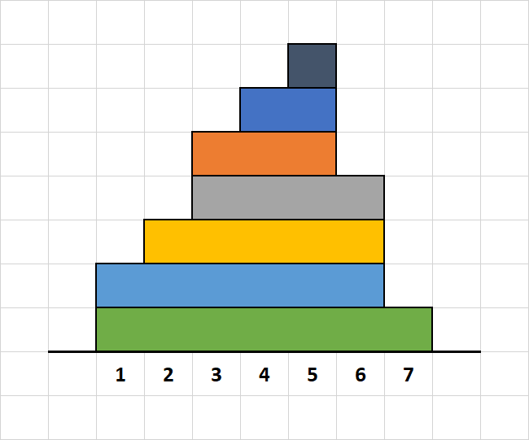

## Hiasan Atap

### Deskripsi

Pak Dengklek ingin membuat hiasan untuk atap rumahnya. Ia memiliki N buah balok berukuran 1 × N, 1 × (N-1), ..., 1 × 1. Ia akan memasang balok-balok tersebut secara berurutan dari yang paling panjang ke yang paling pendek.

Pertama-tama, Pak Dengklek meletakkan balok terpanjang sedemikian sehingga balok tersebut berada pada kolom 1 hingga N. Kemudian, ia akan meletakkan setiap balok selanjutnya di atas tepat balok sebelumnya, dengan salah satu dari dua cara berikut: rata kiri atau rata kanan.

Sebagai contoh, misalkan N = 7. Mulanya, Pak Dengklek akan meletakkan balok 1 × 7 pada kolom 1 hingga 7. Misalkan untuk 6 balok berikutnya, Pak Dengklek secara berturut-turut meletakkan rata kiri, kanan, kanan, kiri, kanan, kanan. Maka, hasil akhir hiasan tersebut adalah sebagai berikut:

Karena Pak Dengklek memiliki sangat banyak balok, maka konfigurasi peletakan balok dinyatakan sebagai string S, yang disambung sebanyak K kali. Dengan demikian, N = |S| × K + 1. Karakter ke-i pada string akhir adalah cara peletakan balok ke-(i+1), dengan karakter 'A' menyatakan rata kiri dan karakter 'B' menyatakan rata kanan. Sebagai contoh, konfigurasi peletakan contoh di atas dapat dinyatakan dengan S = "ABB" dan K = 2.

Pak Dengklek sekarang tertarik untuk mengetahui ketinggian balok tertinggi pada suatu rentang kolom. Sebagai contoh, dari kolom 1 hingga 7, ketinggiannya adalah 7 (balok tertinggi berada pada kolom 5). Contoh lainnya, dari kolom 2 hingga 4, ketinggiannya adalah 6 (balok tertinggi berada pada kolom 4).

Pak Dengklek memiliki Q pertanyaan. Pertanyaan ke-i menanyakan ketinggian balok tertinggi dari kolom L[i] hingga R[i], inklusif. Bantulah ia untuk menjawab pertanyaan-pertanyaan tersebut!

### Format Masukan

Baris pertama akan berisi "label kasus uji". Label kasus uji adalah sebuah string yang dijelaskan sebagai berikut:

- Panjang string tersebut adalah banyaknya subsoal ditambah satu.
- Karakter ke-0 (indeks dimulai dari 0) akan berisi 0 jika kasus uji tersebut merupakan contoh kasus uji, atau berisi '.' (titik) jika bukan.
- Untuk setiap nilai i di antara 1 hingga banyaknya subsoal, berlaku:
  - jika kasus uji tersebut memenuhi batasan subsoal ke-i, maka karakter ke-i berisi i, atau
  - jika kasus uji tersebut tidak memenuhi batasan subsoal ke-i, maka karakter ke-i berisi karakter '.' (titik).

Sebagai contoh, apabila label sebuah kasus uji sebuah soal adalah `0..345`, maka:

- Soal tersebut memiliki 5 buah subsoal,
- Kasus uji tersebut merupakan contoh kasus uji, dan
- Kasus uji tesebut memenuhi batasan subsoal ke-3, ke-4, dan ke-5.

Baris-baris berikutnya diberikan dalam format berikut:

    S
    K Q
    L[1] R[1]
    L[2] R[2]
    .
    .
    L[Q] R[Q]

### Format Keluaran

Q buah baris, masing-masing berisi jawaban dari setiap pertanyaan.

### Contoh Masukan

    0.......8
    ABB
    2 4
    1 7
    2 4
    6 7
    1 1

### Contoh Keluaran

    7
    6
    4
    2

### Penjelasan Contoh

Contoh kasus uji ini sesuai dengan ilustrasi pada deskripsi soal.

### Subsoal

Untuk semua subsoal, berlaku:

- 1 ≤ |S| ≤ 100.000
- S hanya mengandung karakter 'A' atau 'B'.
- 1 ≤ K ≤ 10^9
- 1 ≤ Q ≤ 100.000
- 1 ≤ L[i] ≤ R[i] ≤ N

#### Subsoal 1 (6 poin):

Hanya berisi kasus uji berikut:

    .1......8
    AABA
    3 6
    1 4
    5 9
    10 13
    1 2
    3 5
    10 12

#### Subsoal 2 (8 poin):

Hanya berisi kasus uji berikut:

    ..2.....8
    AABABAABB
    11 7
    1 100
    1 1
    2 2
    3 3
    98 98
    99 99
    100 100

#### Subsoal 3 (11 poin):

- |S| ≤ 1.000
- K = 1

#### Subsoal 4 (9 poin):

- K = 1
- Q = 1

#### Subsoal 5 (16 poin):

- Q = 1

#### Subsoal 6 (15 poin):

- |S| ≤ 2

#### Subsoal 7 (19 poin):

- Untuk setiap i, L[i] = R[i]

#### Subsoal 8 (16 poin):

- Tidak ada batasan tambahan.
