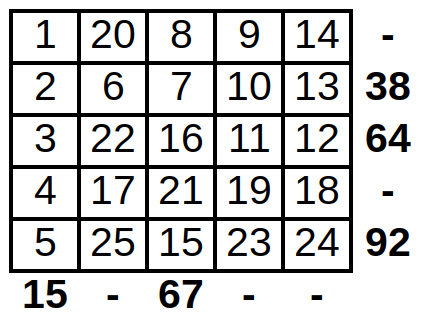
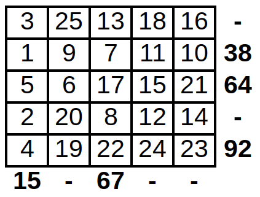
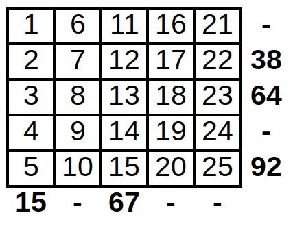

## Permainan Mejik

### Deskripsi

Pak Dengklek membuat permainan soliter baru untuk Anda bernama Mejik. Pada permainan ini, terdapat sebuah papan berisi petak-petak berukuran N baris dan N kolom. Baris-baris dan kolom-kolom dinomori dari 1 sampai dengan N.

Mulanya, setiap petak kosong. Anda diminta mengisi setiap petak dengan bilangan dari 1 hingga N^2, masing-masing tepat sekali, dengan mempertimbangkan petunjuk-petunjuk pada pinggir luar sisi kanan dan bawah papan.

Petak-petak pada pinggir luar sisi kanan dan bawah papan berisi petunjuk berupa salah satu dari:

- Petunjuk jumlah: berupa sebuah bilangan bulat positif, menunjukkan jumlah dari setiap bilangan pada baris (untuk petunjuk sisi kanan) atau kolom (untuk petunjuk sisi bawah) tersebut.
- Petunjuk kosong: berupa karakter '-', yang dapat diabaikan.

Sebagai contoh, berikut adalah dua buah solusi berbeda dari permainan Mejik yang sama. Pada kedua solusi berikut, seluruh petunjuk jumlah terpenuhi.

 

Berikut ini adalah solusi lainnya. Pada solusi ini, hanya satu petunjuk jumlah yang terpenuhi (kolom pertama).

Pada permainan ini, nilai Anda akan bergantung pada banyaknya petunjuk jumlah yang terpenuhi. Semakin banyak semakin bagus, sesuai yang dijelaskan pada bagian Penilaian.

### Informasi Tipe Soal

Soal ini adalah soal "output-only". Untuk setiap kasus uji, Anda menuliskan keluaran program ke dalam sebuah berkas keluaran.

Masukan untuk soal ini dapat diunduh di sini. Di dalam berkas .zip tersebut terdapat 1 + 5 masukan untuk diselesaikan: osn-2018-mejik\_0.in, osn-2018-mejik\_1.in, osn-2018-mejik\_2.in, ..., osn-2018-mejik\_5.in. Masukan contoh (nomor 0) tidak termasuk dalam penilaian peserta.

Untuk setiap berkas masukan yang diselesaikan (Anda tidak harus menyelesaikan semua masukan), buatlah berkas keluaran dengan nama osn-2018-mejik\_X.out, dengan X adalah nomor kasus uji. Setelah itu, kompres semua berkas keluaran dalam sebuah berkas .zip, lalu kumpulkan.

### Format Masukan

Masukan diberikan dalam format berikut:

    N
    R[1] R[2] .. R[N]
    C[1] C[2] .. C[N]

dengan:

- R[i] menyatakan petunjuk di kanan baris ke-i.
- D[i] menyatakan petunjuk di bawah kolom ke-i.

### Format Keluaran

N baris berisi N bilangan yang menyatakan bilangan-bilangan pada solusi.

### Contoh Masukan

    5
    - 38 64 - 92
    15 - 67 - -

### Contoh Keluaran

    1 20 8 9 14
    2 6 7 10 13
    3 22 16 11 12
    4 17 21 19 18
    5 25 15 23 24

### Penjelasan Contoh

Contoh keluaran tersebut menyatakan solusi dari gambar pertama di atas.

### Penilaian

Untuk setiap kasus uji, nilai Anda adalah 20 × (banyaknya petunjuk jumlah yang terpenuhi) / (banyaknya petunjuk jumlah), dibulatkan ke bawah.

### Kasus-Kasus Uji

Untuk setiap kasus uji:

- 4 ≤ N ≤ 8
- Dijamin terdapat setidaknya satu solusi yang memenuhi seluruh petunjuk jumlah.

#### osn-2018-mejik_1.in

- N = 4
- Seluruh baris dan kolom berisi petunjuk jumlah.

#### osn-2018-mejik_2.in

- N = 5
- Hanya baris dan kolom pertama dan terakhir saja yang berisi petunjuk jumlah.

#### osn-2018-mejik_3.in

- N = 6
- Seluruh petunjuk berupa petunjuk jumlah, yang berupa bilangan yang sama.

#### osn-2018-mejik_4.in

- N = 7
- Seluruh baris berisi petunjuk jumlah.
- Seluruh kolom berisi petunjuk kosong.

#### osn-2018-mejik_5.in

- N = 8
