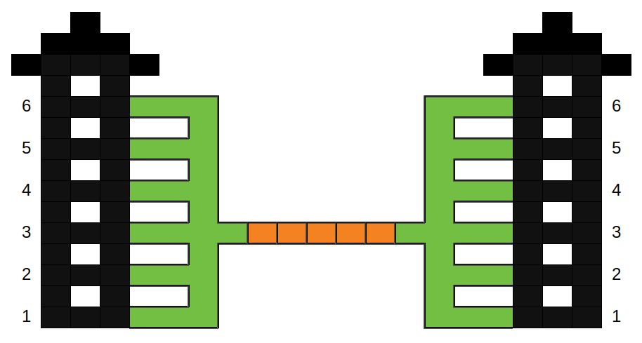
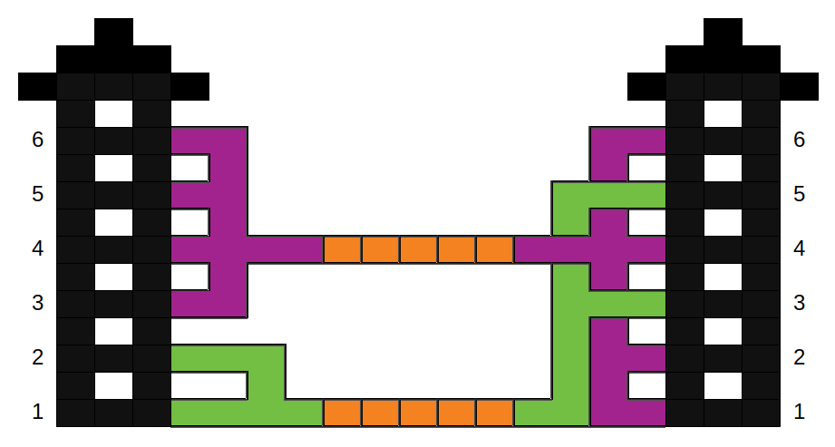

## Jembatan Layang

### Deskripsi

Di kota Padang, terdapat sebuah kampus terkenal bernama Universitas Dengklek. Seluruh mahasiswa kampus tersebut tinggal pada sebuah gedung asrama setinggi N lantai. Tahun ini, pihak kampus selesai membangun gedung asrama baru yang juga setinggi N lantai. 

Terdapat K buah jembatan layang di antara kedua gedung tersebut. Jembatan ke-i terletak pada ketinggian lantai H[i]. Uniknya, setiap lantai dari masing-masing gedung hanya terhubung pada tepat satu jembatan melalui sebuah terowongan khusus. Lantai i pada gedung lama hanya terhubung pada jembatan ke-A[i], dan lantai i pada gedung baru hanya terhubung pada jembatan ke-B[i].

Sekarang, pihak kampus akan merelokasi seluruh mahasiswa ke gedung baru. Setiap lantai di gedung lama akan direlokasi ke sebuah lantai di gedung baru. Tidak ada dua lantai di gedung lama yang direlokasi ke lantai yang sama di gedung baru. Dengan kata lain, pihak kampus ingin mencari sebuah permutasi P dari {1, 2, ..., N} yang menyatakan bahwa penghuni lantai i di gedung lama akan direlokasi ke lantai P[i] di gedung baru.

Untuk alasan keamanan dalam proses relokasi, pihak kampus menerapkan aturan berikut untuk setiap relokasi lantai:

- Penghuni lantai di gedung lama akan menuju ke satu-satunya jembatan yang terhubung, kemudian menyusuri jembatan menuju gedung baru, lalu menuju ke salah satu lantai di gedung baru yang terhubung pada jembatan tersebut.
- Lantai di gedung lama dan lantai di gedung baru tidak boleh keduanya sekaligus lebih tinggi atau sekaligus lebih rendah daripada jembatan yang menghubungkannya.

Atau dengan kata lain, secara formal, untuk setiap i, seluruh syarat berikut harus dipenuhi:

- A[i] = B[P[i]]
- Jika i > H[A[i]], maka harus berlaku P[i] ≤ H[A[i]].
- Jika i < H[A[i]], maka harus berlaku P[i] ≥ H[A[i]].

Sekarang pihak kampus penasaran, sebenarnya ada berapa permutasi berbeda yang mungkin? Karena hasilnya bisa sangat besar, mereka hanya penasaran pada hasilnya modulo 1.000.000.007.

### Format Masukan

Baris pertama akan berisi "label kasus uji". Label kasus uji adalah sebuah string yang dijelaskan sebagai berikut:

- Panjang string tersebut adalah banyaknya subsoal ditambah satu.
- Karakter ke-0 (indeks dimulai dari 0) akan berisi 0 jika kasus uji tersebut merupakan contoh kasus uji, atau berisi '.' (titik) jika bukan.
- Untuk setiap nilai i di antara 1 hingga banyaknya subsoal, berlaku:
  - jika kasus uji tersebut memenuhi batasan subsoal ke-i, maka karakter ke-i berisi i, atau
  - jika kasus uji tersebut tidak memenuhi batasan subsoal ke-i, maka karakter ke-i berisi karakter '.' (titik).

Sebagai contoh, apabila label sebuah kasus uji sebuah soal adalah `0..345`, maka:

- Soal tersebut memiliki 5 buah subsoal,
- Kasus uji tersebut merupakan contoh kasus uji, dan
- Kasus uji tesebut memenuhi batasan subsoal ke-3, ke-4, dan ke-5.

Baris-baris berikutnya diberikan dalam format berikut:

    N K
    H[1] H[2] .. H[K]
    A[1] A[2] A[3] .. A[N]
    B[1] B[2] A[3] .. B[N]

### Format Keluaran

Sebuah baris berisi banyaknya permutasi yang memenuhi syarat, modulo  1.000.000.007.

### Contoh Masukan 1

    0...45.7
    6 1
    3
    1 1 1 1 1 1
    1 1 1 1 1 1

### Contoh Keluaran 1

    36

### Penjelasan Contoh 1

Terdapat 6 lantai, dan 1 jembatan layang yang terletak pada ketinggian lantai 3. Setiap lantai di gedung lama maupun gedung baru, terhubung pada jembatan.

Contoh ini diilustrasikan oleh gambar berikut. Gedung sebelah kiri adalah gedung lama, sedangkan yang sebelah kanan adalah gedung baru.

Menurut aturan yang diberikan, maka:

- Lantai 1 di gedung lama hanya bisa direlokasi ke lantai 3, 4, 5, atau 6 di gedung baru.
- Lantai 2 di gedung lama hanya bisa direlokasi ke lantai 3, 4, 5, atau 6 di gedung baru.
- Lantai 3 di gedung lama bisa direlokasi ke seluruh lantai di gedung baru.
- Lantai 4 di gedung lama hanya bisa direlokasi ke lantai 1, 2, atau 3 di gedung baru.
- Lantai 5 di gedung lama hanya bisa direlokasi ke lantai 1, 2, atau 3 di gedung baru.
- Lantai 6 di gedung lama hanya bisa direlokasi ke lantai 1, 2, atau 3 di gedung baru.

Perhatikan bahwa lantai-lantai 4, 5, dan 6 di gedung lama pasti direlokasi ke lantai-lantai 1, 2, dan 3 di gedung baru. Terdapat 3! = 6 cara. Sisanya, lantai-lantai 1, 2, 3 di gedung lama bisa direlokasi ke lantai-lantai 4, 5, 6 di gedung baru. Terdapat 3! = 6 cara. Dengan demikian, terdapat total 6 × 6 = 36 permutasi yang mungkin.

### Contoh Masukan 2

    0...4..7
    6 2
    1 4
    1 1 2 2 2 2
    2 2 1 2 1 2

### Contoh Keluaran 2

    0

### Penjelasan Contoh 2

Contoh ini diilustrasikan oleh gambar berikut.

Perhatikan bahwa lantai 2 di gedung lama terhubung pada jembatan yang berada pada ketinggian lantai 1 (lantai lebih tinggi daripada jembatan), namun hanya lantai 3 dan 5 di gedung baru yang terhubung pada jembatan tersebut (yang juga lebih tinggi daripada jembatan). Pada kasus ini, lantai 2 tidak dapat direlokasi ke manapun tanpa melanggar aturan yang diberikan, sehingga tidak ada permutasi yang mungkin.

### Subsoal

Untuk semua subsoal, berlaku:

- 1 ≤ K ≤ N ≤ 100.000
- 1 ≤ H[i] ≤ N
- Nilai-nilai H[i] berbeda-beda.
- 1 ≤ A[i], B[i] ≤ K
- A[i] mengandung setiap bilangan dari 1 hingga K.
- B[i] mengandung setiap bilangan dari 1 hingga K.
- Untuk setiap jembatan layang, banyaknya lantai di gedung lama yang terhubung, sama dengan banyaknya lantai di gedung baru yang terhubung.

#### Subsoal 1 (6 poin):

Hanya berisi kasus uji berikut:

    .1..45.7
    5 1
    3
    1 1 1 1 1
    1 1 1 1 1

#### Subsoal 2 (8 poin):

Hanya berisi kasus uji berikut:

    ..2.4..7
    9 4
    2 3 5 8
    2 2 1 3 3 2 3 4 4
    2 1 3 2 3 3 2 4 4

#### Subsoal 3 (10 poin):

- K = N

#### Subsoal 4 (15 poin):

- N ≤ 10

#### Subsoal 5 (23 poin):

- K = 1

#### Subsoal 6 (18 poin):

- Untuk setiap i, H[A[i]] ≠ i
- Untuk setiap i, H[B[i]] ≠ i

#### Subsoal 7 (20 poin):

- Tidak ada batasan tambahan.
